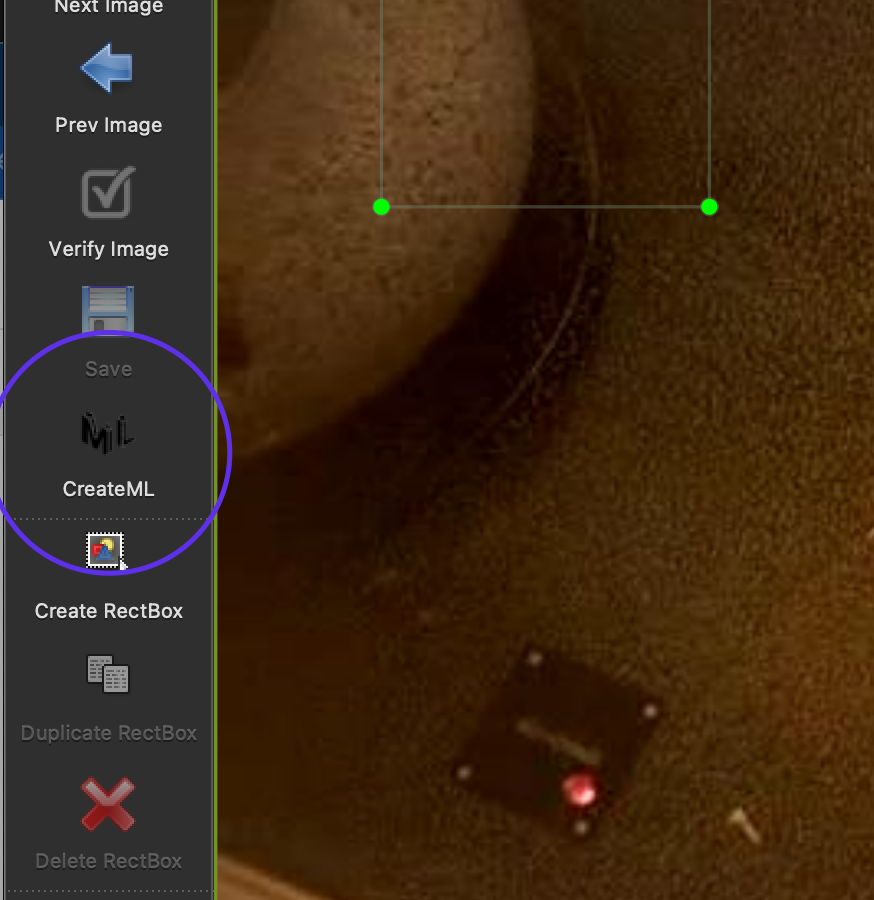
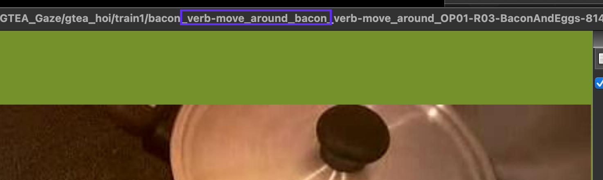
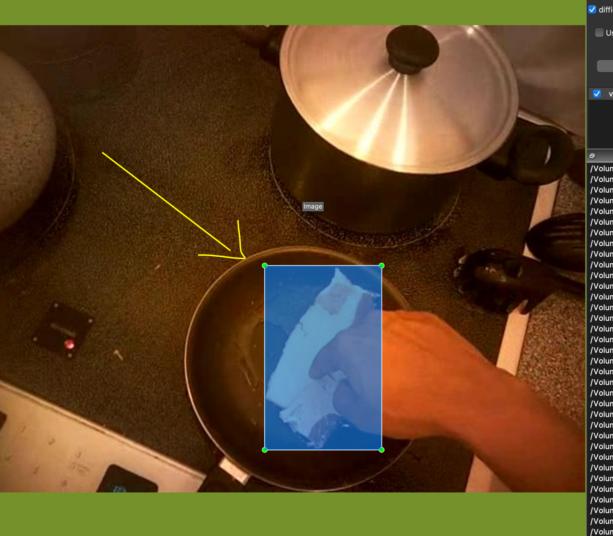
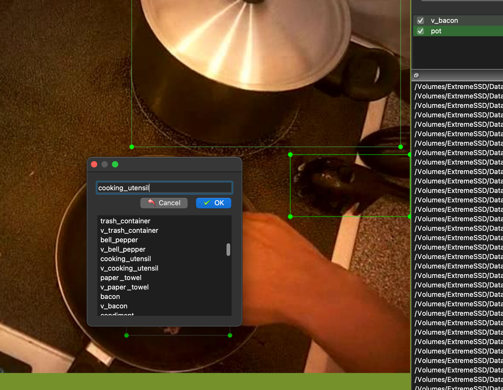

# GTEA HOI

This dataset was originally derived from the [Georgia Tech Egocentric Activity (GTEA) dataset](http://cbs.ic.gatech.edu/fpv/). However it appears their website is now down.

The goals is to add object and interaction annotations to individual frames in the dataset. I.e., bounding boxes and object classes, and annotations for which objects are being acted upon.

## Contribute

We add the annotations using the CreateML json format. We've automatically created annotation files for all images in the respective train and test folders. However, the annotations only contain annotations for objects with an interaction verb, and the bounding boxes are not properly fitted. This is the main area where we need contributions.

### How to

We suggest you edit annotations using [LabelImg](https://github.com/tzutalin/labelImg). After installing LabelImg, you can start editing the annotations by running, for example

```sh
labelImg train1 train1/classes.txt train1
```

and you should see something like this


Now, all the object classes are preloaded (from the classes.txt) file. And each object class is duplicatd with a `v_`-prefix. When labelling objects, use the `v_`-prefixed class when the object is being the object of interaction. Such as the `v_bacon` class in the image above.

#### Before you get started

Ensure that the CreateML format is chosen



#### Fix the annotations

1. Move the pre-created bounding boxes to the appropriate location. If you're unsure of which object it refers to, you can see verb in the file name

   

   Move the bounding box, and resize it to fit the object, as such

   

   If there's clearly no interaction in the image, **REMOVE** the `v_`-prefixed annotation and replace with one without a prefix.

2. Label remaining non-interactive objects (make sure to use non-prefixed classes)

   

3. Repeat for other objects, but **DO NOT** create any new classes.
4. Save (Cmd+S)
5. Move to the next image

It is highly recommended to learn the Keyboard shortcuts, as documented [here](https://github.com/tzutalin/labelImg#hotkeys), to work more efficiently.

Also make sure to coordinate what images you label with other labellers, so that the same work is not performed more than once.
